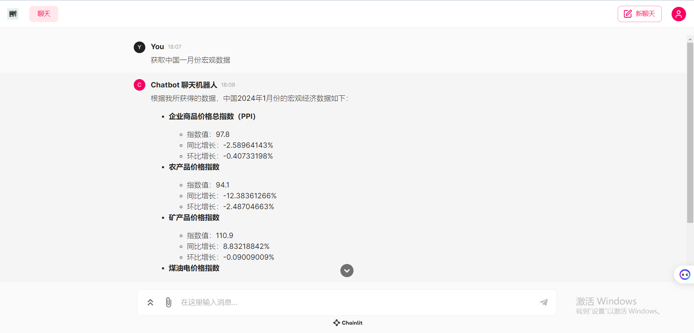

# ChineseStockGPT

## 介绍
ChineseStockGPT是一个创新的对话式人工智能系统，专门设计用于回答与中国股市相关的问题。该系统利用Akshare获取财经数据，并采用RAG（检索增强生成）技术使GPT能够提供有关中国财经的洞察性回答。它适用于所有对中国金融市场动态感兴趣的人，从业余爱好者到严肃的投资者都能从中受益。



## 目录
- [介绍](#介绍)
- [安装](#安装)
- [配置](#配置)
- [使用](#使用)
- [依赖项](#依赖项)
- [特性](#特性)
- [故障排除](#故障排除)
- [贡献者](#贡献者)
- [Star History](#Star History)

## 安装
在开始之前，请确保你有访问OpenAI API的必要权限。按照以下步骤设置ChineseStockGPT：

1. **设置环境变量：**
   - 转到`.env`文件并输入你的OpenAI API密钥以及你打算使用的模型。我们建议使用GPT-4.5或更高版本的模型以获得最佳性能。

2. **安装依赖项：**
   - 运行以下命令安装所需的依赖项：
     ```shell
     pip install -r requirements.txt
     ```

3. **运行应用程序：**
   - 执行以下命令启动系统：
     ```shell
     python pyshellrun.py
     ```

## 配置
主要配置包括在`.env`文件中设置你的OpenAI API密钥和选择适当的GPT模型。确保你有正确的访问权限和API限制以使用这些服务。

## 使用
设置完成后，你可以开始询问与中国股市相关的问题。系统将利用通过Akshare获取的财经数据并基于所选GPT模型生成回答。

## 依赖项
- Akshare：用于获取财经数据。
- OpenAI GPT（建议使用4.5或更高版本）：用于生成基于AI的回答。
- `requirements.txt`中列出的其他Python库。

## 特性
- 实时从中国金融市场获取数据。
- 对复杂的财经相关查询提供AI生成的回答。
- 配置简单，支持各种财经数据集，使用方便。

## 故障排除
如果你在访问OpenAI的API或其他依赖项时遇到任何问题，请确保你的API密钥有效且未超出使用限制。如果在从Akshare获取数据时遇到问题，请检查你的互联网连接和防火墙设置。

## 贡献者
<a href="https://github.com/XingYu-Zhong/ChineseStockGPT/graphs/contributors">
  
</a>

## 🌟Star History
<picture>
  <source
    media="(prefers-color-scheme: dark)"
    srcset="
      https://api.star-history.com/svg?repos=XingYu-Zhong/ChineseStockGPT&type=Date&theme=dark
    "
  />
  <source
    media="(prefers-color-scheme: light)"
    srcset="
      https://api.star-history.com/svg?repos=XingYu-Zhong/ChineseStockGPT&type=Date
    "
  />
  
</picture>


如需进一步的帮助，请参阅官方文档或在项目的仓库页面提交问题。
